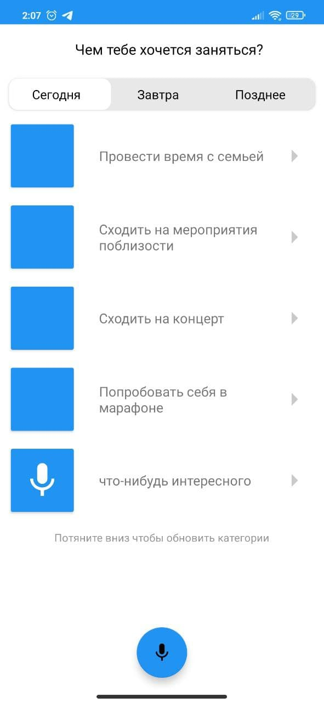
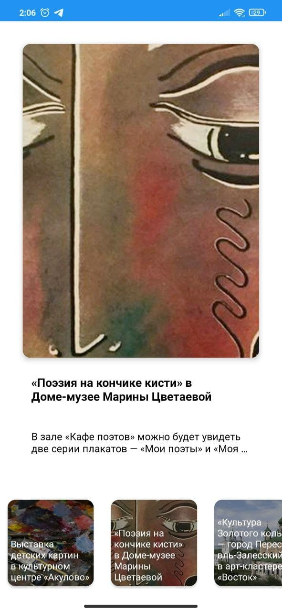
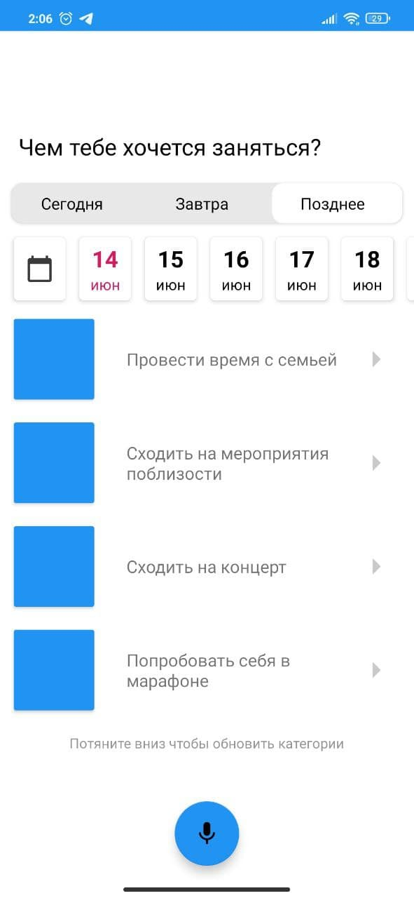

# HelloMoscow

## Задача 
Основная задача – разработать функционал (модель или макет сервиса) по подбору
и планированию мероприятий в городском мобильном приложении «Моя Москва».
В рамках сервиса пользователю должна быть предоставлена возможность
подобрать одно или несколько мероприятий, проходящих в городе Москве, а также
спланировать досуг для самых разных категорий пользователей (например, отдых
всей семьи, ребёнка или одного взрослого).
## Ссылка для скачивания
https://github.com/droidbaza/HelloMoscow/blob/master/app/media/app.apk
## 
    
